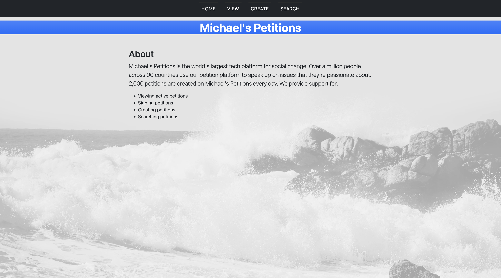

# CT5171 DevOps Assignment
<h3> <div align="center"> http://34.245.149.233:9090/michaelspetitions/ </div> </h3>
<div align="center">  </div>

## Overview
The goal of this project was to develop a web application for petitions which uses DevOps automation for software delivery. 

The web app contains a number of paths which allow users to:

- View Petitions
- Create Petitions
- Search Petitions and View Results
- Sign Petitions

## Request Mappings
```
/
```
- This returns the homepage for the website.
```
/view
```
- This returns a page where all petitions are displayed and can be viewed.
```
/create
```
- This returns a page where a form is available to be filled in so that a user may create a petition on the site.
```
/search
```
- This provides a search bar so that users can enter a query to search through all petitions on the site.
```
/petitions/{id}
```
- This returns a specific petition for a given ID, where the ID is the UUID of the petition.

## Post Mappings
```
/create/new
```
- This takes user input for petition name, description, and scope and creates the petition.
```
/search/results
```
- This displays all of the petitions found for a given user search query.
```
/petition/{id}/sign
```
- This takes a user name and email address and enables them to sign a given petition. These details are then displayed on this petition on the site.

## Software Delivery
Jenkins is used for Continuous Integration (CI) and Continuous Delivery (CD) for this project. Jenkins is run on an EC2 instance where the web application is also deployed.

The web application is containerized using Docker as part of the build, using a tomcat image as the base. The image is pushed to AWS Elastic Container Registry (ECR) for future use and is deployed to the EC2 instance via Jenkins.

When changes are pushed to __master__ in the repository, a Jenkins build is automatically triggered via a webhook. The list of all stages in this delivery process are below.

- Build
- Package
- Login to AWS ECR
- Build Docker Image
- Push to AWS ECR
- Deployment Confirmation
- Deploy Container
- Post Build: Archive WAR as an artifact
